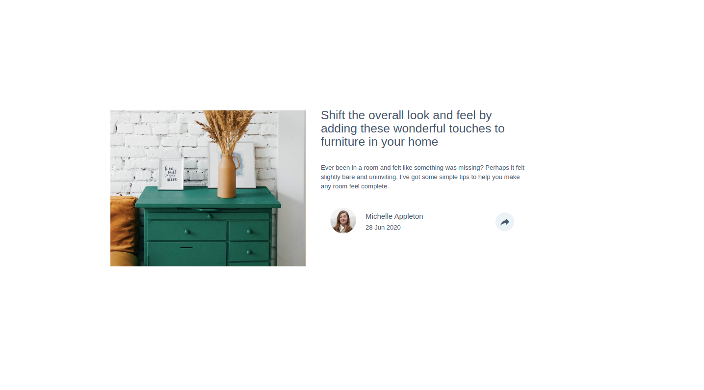

# Frontend Mentor - Article preview component solution

This is a solution to the [Article preview component challenge on Frontend Mentor](https://www.frontendmentor.io/challenges/article-preview-component-dYBN_pYFT). Frontend Mentor challenges help you improve your coding skills by building realistic projects. 

## Table of contents

- [The challenge](#the-challenge)
  - [Screenshot](#screenshot)
  - [Links](#links)
- [My process](#my-process)
  - [Built with](#built-with)
  - [What I learned](#what-i-learned)
- [Acknowledgments](#acknowledgments)

### The challenge

Users should be able to:

- View the optimal layout for the component depending on their device's screen size
- See the social media share links when they click the share icon

### Screenshot

### Links

- Live Site URL: 

## My process
I've been experimenting with Materialize CSS so decided to incorporate that with this challenge. It cut down my time initially but when the time came for placement of the pop-up div, I had to position it individually, which took a while. Either I need to find a way around positioning popup divs in Materialize or just use plain CSS for that particular thing from this point on.

### Built with

- Semantic HTML5 markup
- CSS custom properties
- Flexbox
- CSS Grid
- Mobile-first workflow
- Font Awesome (https://use.fontawesome.com/releases/v5.0.13/css/all.css)
- Materialize CSS (https://cdnjs.cloudflare.com/ajax/libs/materialize/1.0.0/css/materialize.min.css)
- Google Icons (https://fonts.googleapis.com/icon?family=Material+Icons)
- jQuery (https://code.jquery.com/jquery-3.3.1.min.js)

### What I learned

I learned a bit more about how to execute with Materialize. Perhaps I need to learn some other framework but Materialize works well for now.

Positioning with Materialize cuts down immense amounts of time, but I still need to spend time using it, to manipulate it perfectly.

The toggle function took me a while to figure out but once I did, I was really happy. Way more satisfying than watching a youtube tutorial and following along. 

## Acknowledgments

I want to thank FrontEnd Masters for setting up this challenge. 
